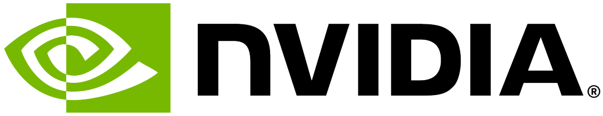
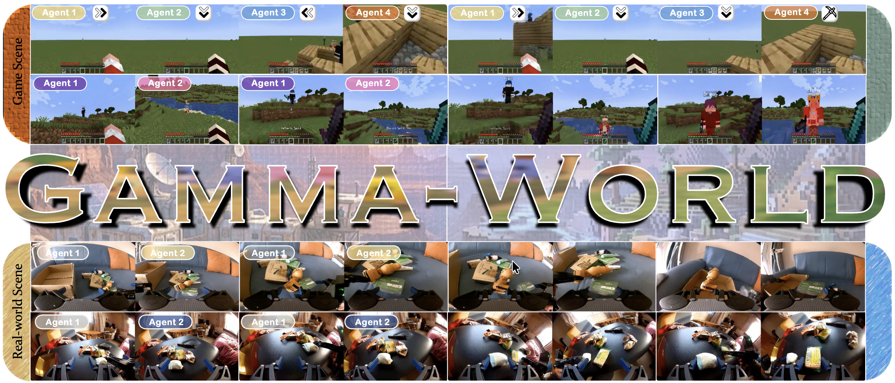
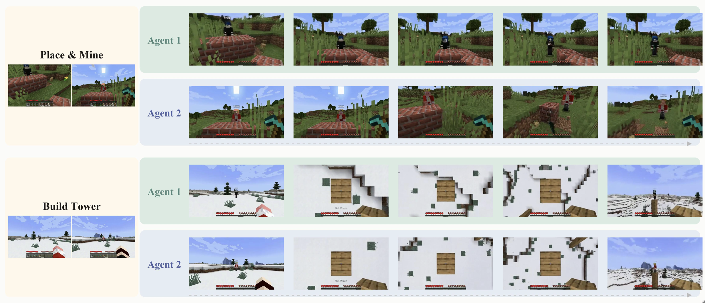
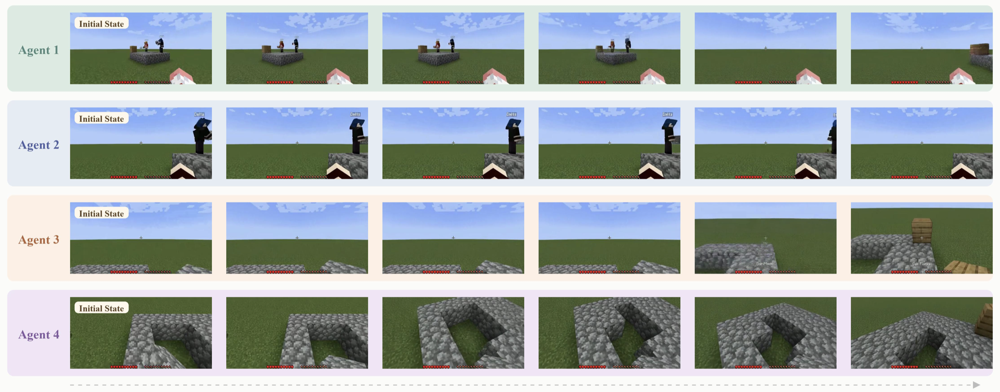
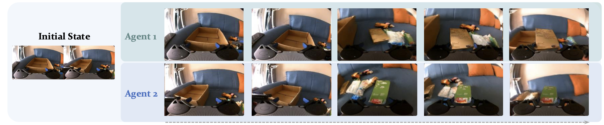
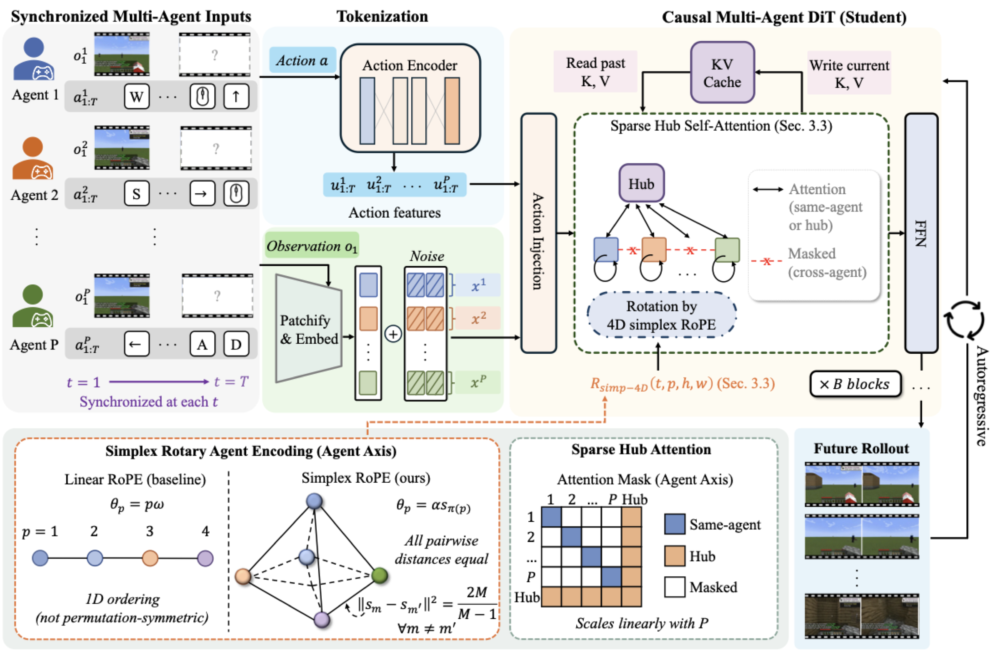
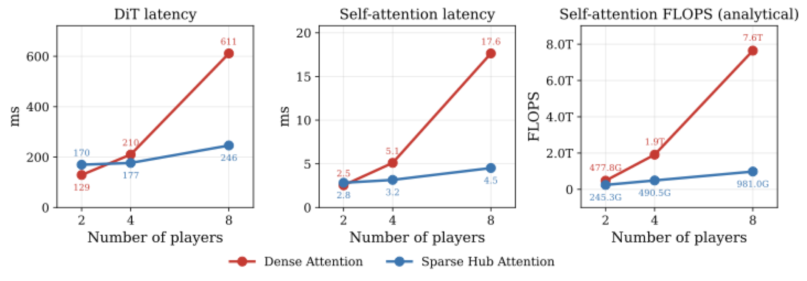

<div align="center">



<h1>
    ✨Gamma-World: Generative Multi-Agent World Modeling<br>
    Beyond Two Players✨
</h1>

<p align="center">
    <a href="https://liuff19.github.io/">Fangfu Liu</a><sup>1,2*</sup>&nbsp;&nbsp;&nbsp;&nbsp;
    <a href="https://www.cs.toronto.edu/~hekai/">Kai He</a><sup>1,3,4*</sup>&nbsp;&nbsp;&nbsp;&nbsp;
    <a href="https://www.cs.toronto.edu/~shenti11/">Tianchang Shen</a><sup>1</sup>&nbsp;&nbsp;&nbsp;&nbsp;
    <a href="https://www.linkedin.com/in/tianshi-cao-a23270b1/">Tianshi Cao</a><sup>1</sup>&nbsp;&nbsp;&nbsp;&nbsp;
    <a href="https://www.cs.utoronto.ca/~fidler/">Sanja Fidler</a><sup>1,3,4</sup>&nbsp;&nbsp;&nbsp;&nbsp;
    <a href="https://duanyueqi.github.io/">Yueqi Duan</a><sup>2</sup>&nbsp;&nbsp;&nbsp;&nbsp;
    <a href="https://www.cs.utoronto.ca/~jungao/">Jun Gao</a><sup>1</sup>
    <br>
    <a href="https://discover.research.utoronto.ca/32914-igor-gilitschenski">Igor Gilitschenski</a><sup>3,4†</sup>&nbsp;&nbsp;&nbsp;&nbsp;
    <a href="https://www.cs.utoronto.ca/~zianwang/">Zian Wang</a><sup>1†</sup>&nbsp;&nbsp;&nbsp;&nbsp;
    <a href="https://xuanchiren.com/">Xuanchi Ren</a><sup>1†</sup>
    <br>
    <br>
    <sup>1</sup>NVIDIA&nbsp;&nbsp;&nbsp;&nbsp;
    <sup>2</sup>Tsinghua University&nbsp;&nbsp;&nbsp;&nbsp;
    <sup>3</sup>University of Toronto&nbsp;&nbsp;&nbsp;&nbsp;
    <sup>4</sup>Vector Institute
</p>

<a href="https://research.nvidia.com/labs/sil/projects/gamma-world/"></a> &nbsp;&nbsp;&nbsp;&nbsp;
<a href="assets/gamma-world.pdf"></a> &nbsp;&nbsp;&nbsp;&nbsp;
<a></a> &nbsp;&nbsp;&nbsp;&nbsp;
<a></a>



</div>

<strong>γ-World:</strong> We introduce a generative multi-agent world model that rolls out a single shared environment for multiple independently controllable agents. γ-World supports permutation-symmetric agent conditioning with <strong>Simplex Rotary Agent Encoding</strong>, efficient cross-agent communication with <strong>Sparse Hub Attention</strong>, real-time <strong>24 FPS</strong> streaming with a distilled block-causal student, and zero-shot generalization from two to four players.

## 📢 News

- 🚀[05/28/2026] We release γ-World with the project page, paper, videos, qualitative results, and method overview.
- 🔜[Coming Soon] We will release the code and distilled streaming checkpoints with KV cache support.
- ⏳[Planned] Training scripts and dataset preparation tools will be released in a future update.

## 🌟 Overview

γ-World interactively generates coherent future frames from multi-agent actions while preserving shared-world consistency, scaling from multiplayer virtual games to real-world multi-robot environments.

https://github.com/user-attachments/assets/11a81855-5b51-4117-bfcd-ef07246e0a4e

## 📖 Abstract

World models for interactive video generation have largely focused on single-agent settings, where future observations are generated from a single control signal. However, many generated environments require multi-agent interaction: multiple players, robots, or embodied agents act simultaneously within a shared space. Scaling world models to such settings requires a principled multi-agent design: agents should remain independently controllable, permutation-symmetric, and support efficient inference while maintaining consistency across time and perspectives.

We present <strong>γ-World</strong>, a generative multi-agent world model for interactive simulation. γ-World introduces <strong>Simplex Rotary Agent Encoding</strong>, a parameter-free extension of 3D RoPE that represents agents as vertices of a regular simplex in rotary angle space. This gives each agent a distinct phase while making all agents permutation-equivalent, enabling scalable agent identity without learned per-slot identities or a fixed agent ordering.

To avoid dense all-to-all attention across agents, we further propose <strong>Sparse Hub Attention</strong>, where learnable hub tokens mediate token interaction across agents, reducing cross-agent attention cost from quadratic to linear in the number of agents. For real-time rollout, we distill a full-context diffusion teacher into a causal student that generates temporal blocks sequentially with KV caching, enabling action-responsive generation at <strong>24 FPS</strong>.

## 🖼️ Gallery

### Two-Agent Interaction

Each agent is independently controllable while sharing the same evolving world.



### Four-Agent Generalization

Benefiting from the permutation-symmetric simplex agent encoding, γ-World generalizes from two to four players <strong>without additional training</strong>.



### Real-World Robotics Coordination

γ-World extends to real-world multi-robot coordination scenarios, demonstrating applicability beyond virtual environments.



## 🧠 Method



γ-World takes synchronized observations and actions from multiple agents as input, tokenizes each agent stream with shared visual and action encoders, and generates future multi-agent rollouts with a causal multi-agent DiT. The model formulates the input with an explicit synchronized agent axis, encodes exchangeable agent identity using Simplex Rotary Agent Encoding, and routes cross-agent information through Sparse Hub Attention. During streaming inference, the causal student uses KV caches for past visual tokens and hub states to preserve block-causal generation while scaling efficiently with the number of agents.

### Simplex Rotary Agent Encoding

Simplex Rotary Agent Encoding is a parameter-free extension of 3D RoPE. Instead of assigning agents scalar indices or learned identity vectors, γ-World places them at the vertices of a regular simplex in rotary angle space. All agents have equal pairwise distances, so every pair is permutation-equivalent while each agent retains a distinct rotary phase.

### Sparse Hub Attention

Sparse Hub Attention routes cross-agent communication through a small set of learnable hub tokens. Agent tokens attend to their own stream and to the hubs; the hubs aggregate information across agents and broadcast it back. This preserves a shared communication pathway without dense pairwise interaction, reducing cross-agent attention from <strong>O(N²)</strong> to <strong>O(N)</strong>.

### Efficiency



Sparse Hub Attention achieves significantly lower latency and FLOPs as the number of agents increases, making γ-World more scalable beyond two players.

## 📚 Citation

If you find γ-World useful for your research or applications, please cite our paper:

```bibtex
@article{gammaworld2026,
    title={Gamma-World: Generative Multi-Agent World Modeling Beyond Two Players},
    author={Fangfu Liu and Kai He and Tianchang Shen and Tianshi Cao and
            Sanja Fidler and Yueqi Duan and Jun Gao and Igor Gilitschenski and
            Zian Wang and Xuanchi Ren},
    journal={arXiv preprint arXiv:2506.XXXXX},
    year={2026}
}
```

## Acknowledgements

The authors would like to thank Product Managers Aditya Mahajan and Matt Cragun for their valuable support and guidance, Jingnan Gao for proof discussion, and Yixin Hong for demo creation.

## License

γ-World will be released under the Apache License 2.0. Final license terms will be confirmed at the code release.
